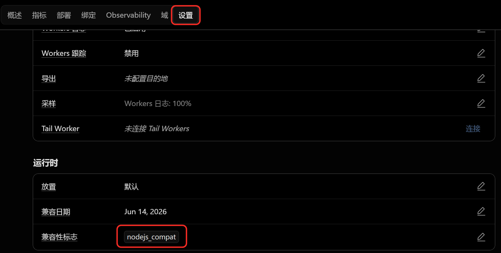

# web2gem

[English](README.md) | [简体中文](README.zh.md)

[](https://deploy.workers.cloudflare.com/?url=https://github.com/Guardinary/web2gem/tree/gemini-account-pool)

带持久化 Gemini Web 账号池的 API 网关，兼容 OpenAI 和 Google Gemini 接口。可以部署到 Cloudflare Workers，也可以使用 Docker 自托管，并通过一个管理页面维护多个 Gemini 账号。

> 当前文档对应独立发布的 `gemini-account-pool` 分支。它使用 D1 持久化存储，与 `main` 的部署模型不同。

[部署到 Cloudflare](#方式一部署到-cloudflare-workers) · [使用 Docker](#方式二通过-docker-部署) · [导入账号](#账号池管理) · [API 示例](#api-接口)

## 目录

- [web2gem](#web2gem)
  - [目录](#目录)
  - [概览](#概览)
  - [核心功能](#核心功能)
  - [开始前准备](#开始前准备)
  - [API 接口](#api-接口)
    - [健康检查](#健康检查)
    - [OpenAI Chat Completions](#openai-chat-completions)
    - [OpenAI Responses](#openai-responses)
    - [OpenAI Images API](#openai-images-api)
    - [Google Gemini API](#google-gemini-api)
  - [模型](#模型)
  - [快速开始](#快速开始)
    - [方式一：部署到 Cloudflare Workers](#方式一部署到-cloudflare-workers)
    - [方式二：通过 Docker 部署](#方式二通过-docker-部署)
  - [与 main 分支的区别](#与-main-分支的区别)
  - [配置](#配置)
  - [账号池管理](#账号池管理)
  - [认证](#认证)
  - [常见问题](#常见问题)
  - [开发](#开发)
  - [测试](#测试)
  - [项目结构](#项目结构)
  - [安全提示](#安全提示)
  - [致谢](#致谢)
  - [许可证](#许可证)

## 概览

`web2gem` 让 OpenAI 兼容客户端和 Google Gemini 兼容客户端通过熟悉的 HTTP API 使用 Gemini Web。本分支增加了持久化账号池：账号只需导入一次，服务会把运行状态保存在 D1 中，为每个请求选择可用账号，并记录失败、冷却和刷新结果。

典型使用流程：

1. 部署 Worker 或 Docker 服务。
2. 配置 D1 和唯一的 `ADMIN_KEY`。
3. 打开 `/admin`，导入一个或多个 Gemini 账号。
4. 如果接口会共享给其他人，配置 `API_KEYS`。
5. 将 OpenAI 兼容或 Gemini 兼容客户端的 Base URL 指向部署地址。

主要兼容目标如下：

| 接口                                | 状态 | 路由                                                                                                 |
| ----------------------------------- | ---- | ---------------------------------------------------------------------------------------------------- |
| OpenAI Chat Completions             | 支持 | `POST /v1/chat/completions`                                                                          |
| OpenAI Responses                    | 支持 | `POST /v1/responses`                                                                                 |
| OpenAI Models                       | 支持 | `GET /v1/models`, `GET /v1/models/{id}`                                                              |
| Google Gemini generateContent       | 支持 | `POST /v1beta/models/{model}:generateContent`, `POST /v1/models/{model}:generateContent`             |
| Google Gemini streamGenerateContent | 支持 | `POST /v1beta/models/{model}:streamGenerateContent`, `POST /v1/models/{model}:streamGenerateContent` |
| Google Models                       | 支持 | `GET /v1beta/models`, `GET /v1beta/models/{model}`                                                   |
| 健康检查                            | 支持 | `GET /`                                                                                              |

## 核心功能

| 功能                       | 说明                                                                                                                                             |
| -------------------------- | ------------------------------------------------------------------------------------------------------------------------------------------------ |
| 持久化账号池               | 在 D1 中保存多个 Gemini Web 账号及其运行状态，不需要把单个账号 cookie 直接放进运行环境。                                                          |
| 内置管理页面               | 在 `/admin` 中导入、查看、筛选、启用、禁用、刷新、检查、编辑和删除账号。                                                                          |
| 自动选择账号               | 为每个生成请求选择符合条件的账号，并避开已禁用、正在冷却或暂时不可用的账号。                                                                      |
| 账号健康状态               | 记录可用性、冷却时间、失败原因、刷新状态和调用结果，同时不暴露已保存的会话凭据。                                                                  |
| 工具调用                   | 将工具定义转换为提示词指令，并把 DSML/XML 风格的工具调用输出解析回兼容 API 响应。                                                                 |
| 结构化输出                 | 对非流式结构化响应执行最终 JSON 校验和规范化；默认拒绝流式结构化输出。                                                                            |
| 大上下文处理               | 可通过账号池选中的账号将大段提示上下文作为 Gemini 文本附件上传，而不是全部以内联文本发送。                                                        |
| 生图                       | 支持非流式 Chat/Responses 请求中的显式 OpenAI `image_generation` 元数据，以及 `/v1/images/generations`、`/v1/images/edits`，并使用账号池选中的账号。 |
| 图片输入处理               | 通过账号池选中的 Gemini 账号解析用户提供的内联/base64 图片；Worker 不抓取远程图片或文件 URL。                                                     |
| 通用文件附件               | 请求内 `input_file` 和非图片内联数据可使用 Gemini Web 上传引用，支持任意文件名和 MIME；不实现持久化 `/v1/files` 服务。                            |
| Worker 和 Docker 部署      | 可使用 Cloudflare Workers 的原生 D1 binding，也可通过 Docker 的 Cloudflare D1 HTTP binding 运行。                                                 |
| 上游 socket 传输           | Workers 在可用时优先使用 `cloudflare:sockets`；Docker 默认使用标准 `fetch`。                                                                      |
| 默认安全失败               | 存储缺失、账号不可用、配置错误或管理操作失败时返回脱敏错误，不会回退到内置凭据。                                                                  |

## 开始前准备

如需完整的账号能力，需要准备：

- 一个或多个你有权使用的 Gemini Web 账号；
- 一个 Cloudflare D1 数据库；
- 一个用于管理页面的强随机 `ADMIN_KEY`；
- 如果使用 Docker，还需要 Cloudflare account ID、D1 database ID 和 API token；
- 如果接口会公开或共享，可额外配置一个或多个 `API_KEYS`。

短文本请求可以在没有 `GEMINI_DB` 时使用 Gemini Web 上游无鉴权模式。请求没有文件引用或图片操作、拼装后的 prompt 不超过 `CURRENT_INPUT_FILE_MIN_BYTES`（默认 95,000 UTF-8 字节），且模型不是 Pro 时，会优先走上游无鉴权模式。Pro、长上下文、附件、生图和图片编辑仍需要 `GEMINI_DB` 与可用账号。Gemini Web 属于可能随时变化的上游 Web 协议，本项目更适合个人、研究和内部使用场景。

## API 接口

### 健康检查

```sh
curl https://your-web2gem.example/
```

返回服务状态、版本号，以及当前适配器暴露的模型 ID。

### OpenAI Chat Completions

```sh
curl https://your-web2gem.example/v1/chat/completions \
  -H "Authorization: Bearer $API_KEY" \
  -H "Content-Type: application/json" \
  -d '{
    "model": "gemini-3.5-flash",
    "messages": [
      { "role": "user", "content": "Write a concise project summary." }
    ]
  }'
```

设置 `"stream": true` 可接收 Server-Sent Events。

生图请求必须使用显式 OpenAI image-generation 元数据。`tool_choice: { "type": "image_generation" }` 或 `tools[]` 中的 `{ "type": "image_generation" }` 会进入 pass-through 生图路径。该模式只使用用户编写的提示词文本和用户提供的内联/已有图片输入；仅有附件没有提示词会被拒绝。Chat Completions 会以 data-image 或 URL markdown 透传上游文本/图片。Worker 不抓取远程图片或文件 URL。生图、图像编辑和图片字节获取都需要配置 D1 后端的 Gemini 账号池。

```sh
curl https://your-web2gem.example/v1/chat/completions \
  -H "Authorization: Bearer $API_KEY" \
  -H "Content-Type: application/json" \
  -d '{
    "model": "gemini-3.5-flash",
    "messages": [{ "role": "user", "content": "Generate a small blue app icon." }],
    "tool_choice": { "type": "image_generation" }
  }'
```

### OpenAI Responses

```sh
curl https://your-web2gem.example/v1/responses \
  -H "Authorization: Bearer $API_KEY" \
  -H "Content-Type: application/json" \
  -d '{
    "model": "gemini-3.5-flash",
    "input": "Explain what this worker does in one paragraph."
  }'
```

Responses 生图使用相同的显式元数据；当图片字节可用时，会返回带 base64 `result` 的 `image_generation_call` output item；只有 URL metadata 时会以 markdown output text 透传。流式生图暂不支持。

### OpenAI Images API

`POST /v1/images/generations` 和 `POST /v1/images/edits` 作为非流式生图路由提供兼容。它们不需要 `tools` 或 `tool_choice`，但仍然需要配置 Gemini 账号池。

```sh
curl https://your-web2gem.example/v1/images/generations \
  -H "Authorization: Bearer $API_KEY" \
  -H "Content-Type: application/json" \
  -d '{
    "model": "gemini-3.5-flash",
    "prompt": "Generate a small blue app icon.",
    "response_format": "b64_json"
  }'
```

图片编辑需要同时提供 `prompt` 和至少一个本地图片输入。JSON 和 multipart 编辑输入可使用 `image`、`images`、`image_url` 或 `input_image`，图片内容必须是内联 base64/data URL 字节。远程 `http://` / `https://` 图片 URL 会被拒绝，Worker 不会抓取。图片端点只支持 `n: 1`，`response_format` 默认是 `b64_json`，也接受 `response_format: "url"` 以返回 provider URL，并且拒绝 `stream: true`。

### Google Gemini API

```sh
curl https://your-web2gem.example/v1beta/models/gemini-3.5-flash:generateContent \
  -H "x-api-key: $API_KEY" \
  -H "Content-Type: application/json" \
  -d '{
    "contents": [
      {
        "role": "user",
        "parts": [{ "text": "Return a short deployment checklist." }]
      }
    ]
  }'
```

流式输出时，在相同模型路径上调用 `:streamGenerateContent`。

## 模型

`web2gem` 在 `src/models/index.ts` 中暴露固定模型映射。

| 模型 ID                          | 说明                                       |
| -------------------------------- | ------------------------------------------ |
| `gemini-3.5-flash`               | 快速通用模型。                             |
| `gemini-3.5-flash-thinking`      | 深度思考模式，输出更长。                   |
| `gemini-3.1-pro`                 | Pro 路由；需要账号池中存在可用账号。       |
| `gemini-3.1-pro-enhanced`        | 实验性的增强 Pro 输出模式。                |
| `gemini-auto`                    | Gemini Web 自动模型选择。                  |
| `gemini-3.5-flash-thinking-lite` | 动态思考，自适应深度。                     |
| `gemini-flash-lite`              | 轻量快速模型。                             |

可以在请求模型 ID 后追加 `@think=N` 覆盖思考深度，例如 `gemini-3.5-flash@think=0`。支持的覆盖值为 `0`、`1`、`2`、`3`、`4`。

## 快速开始

符合条件的短文本生成不需要 `GEMINI_DB`。如需 Pro、长上下文、附件、生图、图片编辑或匿名失败后的账号回退，请配置 `GEMINI_DB`、导入至少一个账号并设置 `ADMIN_KEY`。如果接口会共享给其他人，建议同时配置 `API_KEYS`。

### 方式一：部署到 Cloudflare Workers

> 应该选哪种方式？
>
> - 只想快速体验：使用**部署按钮**。
> - 希望以后自动更新：使用下面的**推荐方式**。

#### 最快方式：部署按钮（仅用于首次部署）

点击下面的按钮，然后按照 Cloudflare 页面提示操作：

[](https://deploy.workers.cloudflare.com/?url=https://github.com/Guardinary/web2gem/tree/gemini-account-pool)

部署时：

- 设置 `ADMIN_KEY`，用于保护管理页面。
- 如果希望客户端必须携带 API Key，请设置 `API_KEYS`；否则可以留空。
- 部署完成后打开 `/admin`，导入你的 Gemini 账号。

部署按钮只适合首次部署，不能自动更新。再次点击会创建另一个项目，而不是升级原 Worker。

#### 推荐：自动更新部署

先 Fork 本仓库，再从 Cloudflare 导入这个 Fork：

1. 打开 [GitHub Fork 页面](https://github.com/Guardinary/web2gem/fork)，取消勾选 **Copy the main branch only**，然后创建 Fork。
2. 在 Fork 中进入 **Settings → Branches**，把 `gemini-account-pool` 设置为默认分支。
3. 进入 **Actions**，启用并手动运行一次 **Upstream Sync**。如果无法推送，把 **Settings → Actions → General → Workflow permissions** 设置为 **Read and write permissions**。
4. 在 Cloudflare Workers 中导入这个 Fork，并部署默认分支。填写 `ADMIN_KEY`；`API_KEYS` 可选。

完成后，Fork 每周会自动检查更新；需要立即更新时，也可以手动运行 **Upstream Sync**。

不要直接修改 Fork 的 `gemini-account-pool` 分支，否则自动同步可能停止，需要手动处理冲突。

<details>
<summary>更新已有的 Deploy Button clone</summary>

如果已经通过按钮部署，请把生成的仓库 clone 到本地，然后执行：

```sh
git remote add upstream https://github.com/Guardinary/web2gem.git
git fetch upstream gemini-account-pool
git merge --no-edit upstream/gemini-account-pool
git push origin HEAD
```

如果 Git 提示冲突，请先解决冲突再推送。不要再次点击部署按钮。

</details>

#### 高级方式：手动部署单文件 Worker

从 [Releases](https://github.com/Guardinary/web2gem/releases) 下载 `web2gem-account-pool-worker.js`，粘贴到 Cloudflare Worker，并添加 `nodejs_compat` 兼容性标记。还需要绑定 `GEMINI_DB` D1 数据库并设置 `ADMIN_KEY`。数据库配置和账号导入步骤见[账号池管理](#账号池管理)。



### 方式二：通过 Docker 部署

使用 [`.env.docker.example`](.env.docker.example) 作为环境变量模板，使用 [`compose.yaml`](compose.yaml) 作为 Compose 服务定义：

```sh
cp .env.docker.example .env
docker compose up -d
```

在 PowerShell 中，请使用 `Copy-Item .env.docker.example .env` 代替 `cp`。

仓库提供的 [`compose.yaml`](compose.yaml) 默认拉取 `ghcr.io/guardinary/web2gem-account-pool:latest`，映射 `${PORT:-52389}:${PORT:-52389}`，并从 `.env` 传入运行时变量。设置 `ADMIN_KEY`，并同时设置 `D1_ACCOUNT_ID`、`D1_DATABASE_ID` 和 `D1_API_TOKEN`，让 Docker 可以管理账号并注入必需的 `GEMINI_DB` binding。共享部署时再设置 `API_KEYS`。如需固定镜像版本，可设置 `WEB2GEM_IMAGE=ghcr.io/guardinary/web2gem-account-pool:<tag>`。

容器启动后，可验证本地健康检查路由：

```sh
curl http://127.0.0.1:52389/
```

然后打开 `http://127.0.0.1:52389/admin`，输入 `ADMIN_KEY` 并导入第一个账号。

如果你在 `.env` 中修改了 `PORT`，请使用修改后的宿主机端口。Docker 部署在 [`.env.docker.example`](.env.docker.example) 中默认将 `UPSTREAM_SOCKET` 设为 `false`，因为 `cloudflare:sockets` 只在 Cloudflare Workers 运行时可用。其他运行时变量与下方配置表相同。

如果只是临时本地测试，也可以不用 Compose，直接构建并运行镜像：

```sh
docker build -t web2gem-account-pool .
docker run --rm -p 52389:52389 --env-file .env web2gem-account-pool
```

Release 页面也提供预构建 Docker 镜像归档。下载与你的平台匹配的归档，加载后运行对应 tag：

```sh
gzip -dc web2gem-account-pool_<tag>_docker_linux_amd64.tar.gz | docker load
docker run --rm -p 52389:52389 --env-file .env web2gem-account-pool:<tag>
```

如果上游 Gemini Web 路径开始返回空输出，先检查 `GEMINI_BL` 是否需要从当前 Gemini Web 前端刷新。如果 Cloudflare 出口请求被限流，可以把 `GEMINI_ORIGIN` 设置成你自己的转发服务或代理地址。

## 与 main 分支的区别

`gemini-account-pool` 是 `web2gem` 的持久化存储版本，与 `main` 独立发布。两者保留相近的 OpenAI 兼容和 Google 兼容生成接口，但账号配置与运行方式不同。

维护者在默认分支运行 **Actions → Release Account Pool Edition** 发布此版本。共享发布控制面会检出 `gemini-account-pool`、创建 `pool-v*` tag，并从已捕获的 revision 发布账号池专用产物和容器镜像。

| 方面 | `main` | `gemini-account-pool` |
| --- | --- | --- |
| Gemini 凭据 | 直接读取当前运行环境中配置的 Gemini cookie。 | 将多个 Gemini 账号保存到 D1，并在每次生成请求时选择可用账号。 |
| 持久化 | 不提供持久化 Gemini 账号存储。 | 在 `GEMINI_DB` 中持久化账号元数据、健康状态、冷却时间、刷新状态和协调锁。 |
| 管理方式 | 不需要持久化账号池控制台。 | 提供 `/admin` WebUI 和资源化的 `/admin/accounts` API，使用唯一 `ADMIN_KEY` 保护。 |
| 部署要求 | 可以在没有账号数据库的情况下运行。 | 符合条件的短文本请求不需要 D1；Pro、长上下文、附件、生图、图片编辑和账号回退需要 D1 binding 与可用账号。 |
| Docker 集成 | 使用标准 Docker 适配层和运行时环境变量。 | 通过 `D1_ACCOUNT_ID`、`D1_DATABASE_ID` 和 `D1_API_TOKEN` 注入 D1 HTTP binding。 |
| 运行时配置 | 使用 main 分支的配置契约。 | 对 boolean、整数、origin、文件名和 `API_KEYS` 执行严格校验；`ADMIN_KEY` 作为普通单字符串配置读取。无效值类型的错误诊断会脱敏。 |
| Admin API | 不适用于持久化账号池。 | 使用 `PATCH` / `DELETE /admin/accounts/:id`，以及 `POST /admin/accounts/:id/refresh`；公共 `x-api-key` 永远不能授权管理操作。 |

生产 bundle 还让 Worker 与 Docker 共用同一个应用路由边界，并为流式处理、socket 解析和结构化输出路径提供代表性性能门禁。这些只是本分支的实现差异，不表示 `main` 会采用相同变更。

## 配置

配置默认值位于 `src/config/index.ts`。Cloudflare Worker 环境变量 / secrets 和 Docker 环境变量都会在运行时覆盖这些默认值。

| 变量                            | 默认值                      | 说明                                                                                                                                                                               |
| ------------------------------- | --------------------------- | ---------------------------------------------------------------------------------------------------------------------------------------------------------------------------------- |
| `API_KEYS`                      | empty                       | 逗号分隔或 JSON 数组形式的 API keys。为空时关闭认证；空成员、非字符串成员和重复项会被拒绝。                                                                                       |
| `ADMIN_KEY`                     | empty                       | 账号池管理接口使用的唯一 admin key。公共 `API_KEYS` 不能管理账号池。                                                                                                            |
| `D1_ACCOUNT_ID`                 | empty                       | 仅 Docker 使用的 Cloudflare account ID，用于 D1 HTTP binding。需与 `D1_DATABASE_ID`、`D1_API_TOKEN` 同时设置；只设置一部分会导致启动失败。                                             |
| `D1_DATABASE_ID`                | empty                       | 仅 Docker 使用的 Cloudflare D1 database ID，用于注入 `GEMINI_DB` binding。                                                                                                          |
| `D1_API_TOKEN`                  | empty                       | 仅 Docker 使用的 Cloudflare API token，需要具备查询该 D1 数据库的权限。Adapter 错误会脱敏该 token 和 SQL bind values。                                                              |
| `GEMINI_BL`                     | bundled value               | 上游请求使用的 Gemini Web build label。如果 Gemini Web 变化导致上游响应为空，需要更新它。                                                                                          |
| `GEMINI_ORIGIN`                 | `https://gemini.google.com` | 不含凭据、路径、查询或 fragment 的绝对 HTTP(S) 上游 origin。可指向你自己的转发服务或代理 origin。                                                                                  |
| `UPSTREAM_SOCKET`               | `true`                      | 可用时优先使用 `cloudflare:sockets` 作为上游传输。                                                                                                                                 |
| `DEFAULT_MODEL`                 | `gemini-3.5-flash`          | 请求省略 `model` 时使用的模型。                                                                                                                                                    |
| `RETRY_ATTEMPTS`                | `3`                         | 上游重试次数；必须是 `1` 到 `10` 的严格整数。                                                                                                                                      |
| `RETRY_DELAY_SEC`               | `2`                         | 重试间隔秒数；必须是 `0` 到 `60` 的严格整数。                                                                                                                                      |
| `REQUEST_TIMEOUT_SEC`           | `180`                       | 上游请求超时秒数；必须是 `1` 到 `3600` 的严格整数。                                                                                                                                |
| `REQUEST_BODY_MAX_BYTES`        | Worker：`16777216`；Docker：`67108864` | 缓冲式生成 JSON 请求体（包括内联 Base64 数据）的最大字节数，可设置为 `1` 到 `104857600`。Multipart 图像编辑不受此项影响，仍由 `GENERIC_FILE_UPLOAD_MAX_BYTES` 加表单开销独立控制。 |
| `LOG_REQUESTS`                  | `false`                     | 启用结构化运行阶段日志。                                                                                                                                                           |
| `CURRENT_INPUT_FILE_ENABLED`    | `true`                      | 启用用于大提示上下文的 Gemini 文本附件。                                                                                                                                           |
| `CURRENT_INPUT_FILE_MIN_BYTES`  | `95000`                     | 触发文本附件处理前的内联提示字节阈值。                                                                                                                                             |
| `CURRENT_INPUT_FILE_NAME`       | `message.txt`               | 大消息上下文附件使用的文件名。                                                                                                                                                     |
| `CURRENT_TOOLS_FILE_NAME`       | `tools.txt`                 | 大工具定义上下文附件使用的文件名。                                                                                                                                                 |
| `GENERIC_FILE_UPLOAD_MAX_BYTES` | `20971520`                  | 每个请求内附件的最大字节数。默认上传路径不会向 `content-push.googleapis.com` 发送 Gemini cookie 或 SAPISID 鉴权；请求内附件不可用或上传失败时会忽略附件并在提示词中追加说明。        |

使用 Wrangler CLI 管理 Worker 时，可通过以下命令配置 secrets：

- 共享部署时设置 `API_KEYS`。为空时会关闭认证。
- 使用账号池管理接口前设置 `ADMIN_KEY`。缺失时 admin 接口不会公开放行。
- 将 D1 数据库绑定为 `GEMINI_DB`，并在承载 Pro、长上下文、附件或图片等需要账号的流量前通过 admin 接口导入 Gemini 账号。

```sh
wrangler secret put API_KEYS
wrangler secret put ADMIN_KEY
```

## 账号池管理

最简单的使用方式是内置 WebUI：

1. 打开 `https://your-worker.example/admin`。
2. 输入配置好的 `ADMIN_KEY`，并选择使用 session storage 或 local storage 保存到浏览器。
3. 导入 `__Secure-1PSID` 和 `__Secure-1PSIDTS` 的纯值。
4. 确认账号显示为已启用且可用。
5. 通过任意受支持的 API 路由发送生成请求。

建议使用新的或专门的 Gemini 浏览器会话。不要粘贴完整 Cookie header、浏览器 Cookie 导出、Cookie 名称、等号、分号或无关的 access token。管理响应和账号列表均已脱敏，不会返回保存的会话凭据。

当前分支使用混合上游路由。符合条件的短文本请求会先走 Gemini Web 上游无鉴权模式，并且不会读取 D1；如果匿名生成在输出前失败，Provider 会通过现有的最少在途请求与轮询账号池选择一个账号并重试一次。Pro、长上下文、附件、生图和图片编辑直接走账号池。部署缺少认证会话能力时返回 HTTP 422、错误码 `gemini_authenticated_session_required` 和机器可读的 `reason`；已配置账号池但暂时没有可用账号时返回 HTTP 503 与 `no_available_gemini_account`，而匿名请求失败且没有回退账号时保留原始匿名上游错误。

Worker 部署时，创建 D1 数据库，执行 [`migrations/0001_gemini_accounts.sql`](migrations/0001_gemini_accounts.sql)，并在 `wrangler.jsonc` 或 Cloudflare 控制台配置中把它绑定为 `GEMINI_DB`。该 schema 会创建结构化的 `gemini_accounts`、`gemini_pool_meta` 和 `gemini_account_locks` 表，不会把账号状态作为单个 JSON blob 存储。

新建 D1 数据库时，执行一次迁移：

```sh
wrangler d1 execute <database-name> --file migrations/0001_gemini_accounts.sql --remote
```

账号池 schema 目前仍只用于开发，不提供兼容迁移。如果本地数据库由更早版本创建，请先重新创建数据库，再执行当前的 `0001` migration。

Docker 部署时，在 `.env` 中同时设置 `D1_ACCOUNT_ID`、`D1_DATABASE_ID` 和 `D1_API_TOKEN`。三者都存在时，`scripts/docker-server.mjs` 会注入一个基于 Cloudflare D1 HTTP API 的 D1 兼容 `GEMINI_DB` binding。只设置一部分时，启动会以配置错误失败。

Worker 的账号导入每个管理请求最多接受 40 个账号，以确保原生 D1 工作量低于 Workers Free 的单次调用查询上限。导入更多账号时，内置 `/admin` 页面会先提交完整批次；仅当 Worker 返回稳定的数量上限错误后，页面才会自动按每批 40 个顺序重试并汇总结果。直接调用管理 API 的客户端仍需自行拆分请求。Docker 不应用此账号数量上限，因此页面的首次完整请求会保持为单次请求；Docker 导入仍受统一的 256 KiB 管理请求体限制。

如果需要自动化，可以使用 `/admin/accounts` 下的管理 API。请求必须使用配置的唯一 `ADMIN_KEY` 鉴权，可通过 `Authorization: Bearer <key>` 或 `X-Admin-Key` 发送。公共 `API_KEYS` 和查询参数 `key` 不能调用这些管理接口。

默认 Gemini 导入只接受裸 cookie 值：

```sh
curl -X POST "https://your-worker.example/admin/accounts" \
  -H "Authorization: Bearer $ADMIN_KEY" \
  -H "Content-Type: application/json" \
  -d '{"provider":"gemini","accounts":[{"__Secure-1PSID":"<仅值>","__Secure-1PSIDTS":"<仅值>","label":"primary"}]}'
```

重复导入会被安全跳过。`GET /admin/accounts` 只接受 `limit`、`cursor`、`q` 和 `state`，并始终返回当前页以及全局 `total`、`available`、`cooling`、`attention`、`disabled` 统计。账号摘要只包含身份、标签、派生健康状态、当前规范化问题、冷却时间和核心时间戳；cookie 与 hash 永远不会越过管理接口边界。

```sh
curl "https://your-worker.example/admin/accounts?state=attention&q=primary" \
  -H "Authorization: Bearer $ADMIN_KEY"
```

四种 UI 状态均由运行数据派生而不是持久化：人工禁用为 `disabled`，有效冷却为 `cooling`，持久的认证/人工操作/地区问题为 `attention`，其他可选账号为 `available`。运行时问题只使用 `auth`、`rate_limit`、`user_action`、`location` 或 `transient`。请求成功或认证刷新成功会清除问题与冷却；模型或能力错误只属于当前请求，不会污染整个账号的健康状态。

显式刷新接口只对 admin 开放：

```sh
curl -X POST "https://your-worker.example/admin/accounts/<account-id>/refresh" \
  -H "Authorization: Bearer $ADMIN_KEY"
```

所有 mutation 都返回同一个紧凑结构：`processed`、`changed`、`unchanged`、`failed`，以及可选的脱敏 `errors`；mutation 不会回显账号行。WebUI 只保留导入、搜索/状态筛选、刷新、重命名、启用/禁用、删除、选择和分页，不再提供可编辑运行状态、Check、CSV 导出或持久诊断面板。启动、健康检查和公开模型列表不会选择账号、调用 `/app`、刷新 cookie 或探测 Google。

导入账号时，只使用当前支持的最短凭据形式：`__Secure-1PSID` 和 `__Secure-1PSIDTS`。用新的无痕浏览器 Gemini 登录，提取这些值后关闭浏览器，通常比复制日常浏览器的完整 cookie header 更稳定。

本地开发时，可以使用 Wrangler 环境支持，或通过本地 Worker 环境传入 bindings。

## 认证

当 `API_KEYS` 为空时，公开生成路由不需要客户端鉴权；管理路由仍然必须使用 `ADMIN_KEY`。任何共享部署都应至少设置一个 API key。

`web2gem` 接受以下形式：

- `Authorization: Bearer <key>`
- `x-api-key: <key>`
- `x-goog-api-key: <key>`

健康检查路由 `GET /` 保持未认证，方便部署探针在没有 secrets 的情况下工作。

## 常见问题

| 现象 | 检查方式 |
| --- | --- |
| 返回 `gemini_authenticated_session_required` | Pro、长上下文、附件或图片请求需要当前部署尚未配置的认证 Gemini 会话。查看 `reason`，再为 Worker 添加 D1 binding，或为 Docker 同时填写三个 D1 凭据。 |
| 返回 `no_available_gemini_account` | 直接走账号池的请求没有可选账号。打开 `/admin`，导入并启用账号，检查账号是否处于冷却状态或需要更新凭据。 |
| 返回 `invalid_runtime_config` | 检查环境变量：boolean 只能是 `true`/`false`，整数必须在范围内，`ADMIN_KEY` 必须是单个非占位字符串。 |
| 管理页面返回 401 | 确认 WebUI 输入值与 `ADMIN_KEY` 一致；公共 `API_KEYS` 不能授权管理操作。 |
| Docker 在监听端口前退出 | 同时配置 `D1_ACCOUNT_ID`、`D1_DATABASE_ID` 和 `D1_API_TOKEN`，再查看容器日志中的脱敏启动错误。 |
| Gemini 返回空内容 | 检查 `GEMINI_BL` 是否仍与当前 Gemini Web 前端一致。如果 Cloudflare 出口受限，配置兼容的 `GEMINI_ORIGIN`。 |
| 图片编辑请求被拒绝 | 使用内联 base64/data URL 或 multipart 图片数据；服务不会抓取远程 `http://`、`https://` 图片 URL。 |

## 开发

手写源码位于 `src/`。不要手动编辑 `dist/` 下的生成文件。

```sh
pnpm install
pnpm check:static
pnpm typecheck
pnpm check:arch
pnpm unit
pnpm smoke
```

构建脚本会输出两个 bundle：

| Bundle                | 来源                | 用途                              |
| --------------------- | ------------------- | --------------------------------- |
| `dist/worker.js`      | `src/index.ts`      | 由 Wrangler 部署的生产 Worker。   |
| `dist/worker.test.js` | `src/test-index.ts` | 带内部辅助导出的本地测试 bundle。 |

## 测试

| 命令                | 说明                                                                                       |
| ------------------- | ------------------------------------------------------------------------------------------ |
| `pnpm check:static` | 运行 Biome 静态分析，并将 warning 作为错误处理。                                           |
| `pnpm check:worker-types` | 检查生成的 Cloudflare Worker binding 类型是否为最新。                               |
| `pnpm typecheck`    | 使用严格编译器设置运行 TypeScript 检查。                                                   |
| `pnpm check:arch`   | 强制导入边界，并检测源码依赖环。                                                           |
| `pnpm unit:quick`   | 在需要时重建过期测试 bundle，然后用 Vitest 运行 `tests/unit/` 下的本地单元检查。           |
| `pnpm unit`         | 构建两个 bundle，并用 Vitest 运行 `tests/unit/` 下的本地单元检查。                         |
| `pnpm coverage`     | 构建隔离 coverage bundle，并将 Vitest V8 lcov 和 JSON summary 报告写入 `coverage/`。       |
| `pnpm coverage:ci`  | 运行带全局阈值、源码行覆盖率和分支覆盖率门禁的 Vitest V8 coverage。                        |
| `pnpm smoke`        | 构建两个 bundle，验证 public exports、请求级路由、健康检查路由和 DSML 工具调用解析。       |
| `pnpm check:bench`  | 针对代表性热路径运行性能回归门禁。                                                         |
| `pnpm check:size`   | 构建生产 Worker，并检查 gzip bundle 体积预算。                                             |
| `pnpm docker:smoke` | 构建 Docker 镜像，运行临时容器，并通过 Node adapter 验证健康检查、认证和 OpenAI 路由行为。 |

Coverage 构建会把带 sourcemap 的测试 bundle 写入 `dist-coverage/`，避免普通 `dist/` 构建与 coverage 运行共享生成产物。Vitest 会发现 `tests/unit/*.test.mjs` wrapper 供 `pnpm unit` 使用；共享 case list 位于 `tests/unit/*.cases.mjs`，使用 Vitest-backed assertions；coverage 使用 Vitest 的 V8 provider 作用于隔离测试 bundle。`pnpm coverage` 和 `pnpm coverage:ci` 使用 Node runner，因此环境变量在 Windows 和 Unix shell 下处理一致。`pnpm coverage:ci` 还会通过 `scripts/check-coverage.mjs` 读取 `coverage/coverage-summary.json`，以捕获关键源码目录和选定高风险分支路径中的回归。

推荐 pre-commit gate：

```sh
pnpm check:static
pnpm typecheck
pnpm check:arch
pnpm unit
pnpm coverage:ci
pnpm smoke
# Docker 可用时可选：
pnpm docker:smoke
```

## 项目结构

```text
.
├── scripts/                 # 构建、架构、单元测试和 smoke 脚本
├── src/
│   ├── completion/          # Provider-neutral completion runtime
│   ├── config/              # 运行时配置解析
│   ├── gemini/              # Gemini Web client、transport、uploads、provider adapter
│   ├── http/                # HTTP 边界、OpenAI 和 Google 协议适配器
│   ├── models/              # 暴露的模型映射和模型解析
│   ├── promptcompat/        # API 请求形状到 Gemini prompt text 的转换
│   ├── shared/              # Provider-neutral 工具
│   ├── toolcall/            # 工具调用提示词、策略、解析器、格式化器
│   └── toolstream/          # 流式工具调用检测状态
├── tests/unit/              # 本地单元检查
├── wrangler.jsonc           # Cloudflare Worker 部署配置
└── package.json             # Node scripts 和开发依赖
```

## 安全提示

本项目适配 Gemini Web 行为，并依赖可能随时变化的上游 Web 协议细节。请将它用于个人、研究或内部验证场景；在共享部署前，请自行评估上游服务的条款和风险。

不要提交 Gemini cookies 或 API keys。请将 secrets 存放在 Cloudflare Worker secrets、Docker 环境管理或其他部署 secret 机制中。

## 致谢

[](https://linux.do/)

## 许可证

[MIT](LICENSE)
